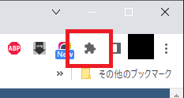
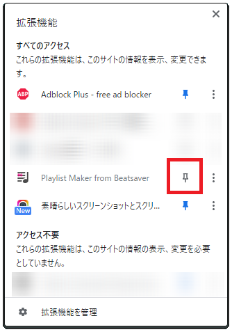
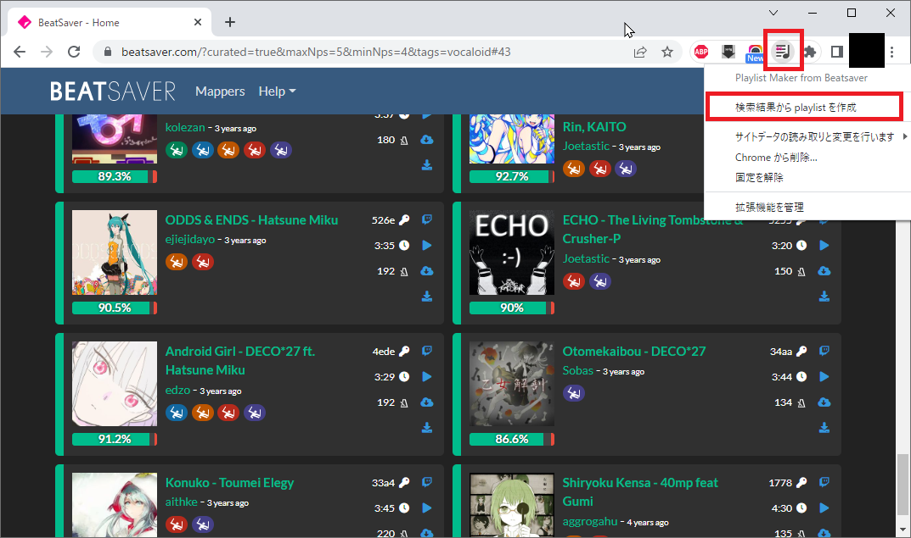

# BSPlaylistMaker

## 概要
- beatsaver.com で検索した結果から playlist を作成する Chrome 拡張プラグインです。
- **生成する対象は現在表示されている曲だけです。検索結果のすべてを対象にしたい場合、下に画面をスクロールして全曲表示させてから実行してください。**
- これを使用したことによる損害について責任は持てませんのであしからず。

## インストール手順
1. [Release ページ](https://github.com/ranmd9a/BSPlaylistMaker/releases/latest)から最新の BSPlaylistMaker.zip をダウンロードして、任意のディレクトリに展開してください。
2. すでに beatsaver.com を開いている場合は閉じてください。
3. Chrome で chrome://extensions を開きます。
4. 右上にある [デベロッパーモード] を有効 (●が右にある状態) にします。
5. [パッケージ化されていない拡張機能を読み込む]ボタンを押して、1. で展開したディレクトリ(manifest.json のあるディレクトリ)を指定します。
6. 拡張機能の一覧に [Playlist Maker from Beatsaver] が追加されたら拡張機能の画面は閉じてください。
7. Chrome の右上にあるパズル型のアイコンをクリックしてください。
   

8. 下記のような画面が開くのでピンのアイコンをクリックしてください。
   

## アンインストール手順
1. Chrome で chrome://extensions を開きます。
2. 拡張機能の一覧にある [Playlist Maker from Beatsaver] の [削除]ボタンを押してください。
3. インストール手順の 1. で展開したディレクトリをディレクトリごと削除してください。
4. アンインストール前に Chrome で beatsaver.com を開いていた場合は F5 キーなどでリロードしてください。

## 使い方
1. Chrome で beatsaver.com を開き、検索してください。
2. 検索結果を一番したまで表示してください。
3. 右上の Playlist Maker from Beatsaver のアイコンをクリックして「検索結果から playlist を作成」をクリックしてください。
   

4. 「search_result_20220417-0920.bplist」のようなファイル名で playlist がダウンロードされます。  
   Beatsaber インストールディレクトリの Playlists フォルダに格納して、ゲーム内もしくは beatlist などで曲をダウンロードしてください。
 
